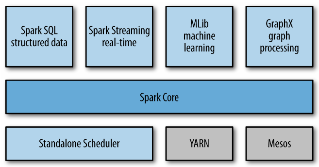
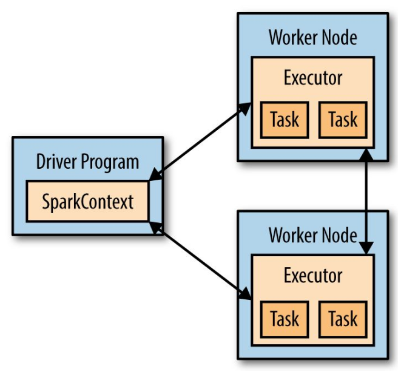
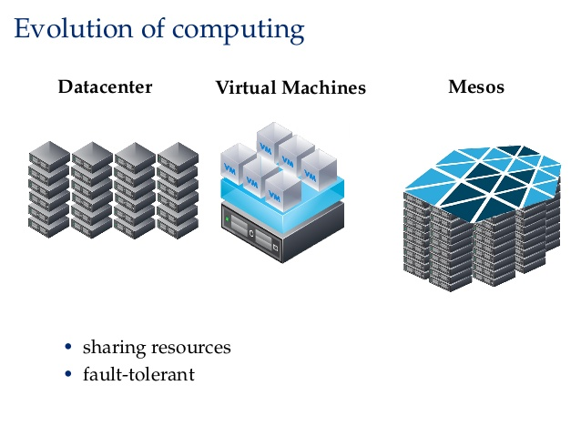

# Spark: Historia 
Paco Mekler
---

## Historia (Hardware)
* Tasas de transferencia
* Tasas de lectura/escritura
* CPU
* Discos de estado sólido
* Todo a menor precio

## Historia (OpenSource y sus usuarios)
* Se crea Apache Hadoop
* Usar la tecnología de datos grandes ya no implica 300k USD en licencia
* Se democratiza el acceso a la  tecnología

## Historia (Grandes compañías)
* Google (...)
* Facebook (Presto, Cassandra)
* Rackspace 
* Amazon (Redshift)

## Hadoop y HDFS
* Primer componente en existir del Big Data
* Hadoop Filesystem es la base de muchos servicios:
	* Hive
	* Spark
	* Cassandra
	* etc
* Perdura la alta redundancia en el manejo de archivos

## Quién usa Hadoop FS
* Acelerador de hadrones
* Farmaceuticas
* Usuarios obvios (google, facebook,etc.)

## Hadoop Yarn
  
  

## ¿Por qué Spark? (herramientas)
* Un sólo framework, múltiples herramientas
	* Streaming (en vivo)
	* GraphX (análisis de redes)
	* Spark SQL 
	* Machine Learning 
	
## ¿Por qué Spark? (programación)
* Un sólo framework, múltiples lenguajes
	* R
	* Python
	* Java
	* Scala
	
## ¿Por qué Spark? (recursos humanos)
* Un sólo framework, recursos humanos simplificado
	* Contratar gente que sepa python/R es más sencillo que para scala
	* SQL permite a no programadores usar la herramienta
* De entrada, no se necesita un perfil super sofisticado

## ¿Qué lenguaje se usa más en Spark?
* Python
* Scala
* R
* Java

## ¿Por qué debería aprender Scala?
* Features nuevos sólo funcionan en Scala
	* No hay un port inmeadiato a otros lenguajes
* Desempeño
* Scala es un lenguaje completo y complejo como python
	* Puedo construir APIs
	* Sitios web
	* Todo orientado a la escalabilidad

## Spark
  1. Spark proyecto UC Berkeley AMP lab en 2009.
  
  
## Spark 1.x
* Sale en el 2014
* RDD
* En Spark 1.6:
	* R
	* Python
* SQL
  
## Spark 2.x
* Sale en el 2016
* Mejoras al SQL API
* Datasets

## Componentes de Spark
  
  
## Funcionamiento
  

## Modos de Funcionamiento
1. Standalone
2. Cluster
3. Mesos
4. Yarn

## Apache Mesos
  

## Preparativos (python3)
* Copien y peguen esto en la terminal
	`export PYSPARK_PYTHON=python3`
	
	Ahora, podrán usar python3 desde pyspark
* Inicien spark en yarn
	`pyspark --master yarn --conf spark.dynamicAllocation.enabled=True`


## Ejercicios
#### RDD + CSV
```
from pyspark.sql import Row

T503 = Row(
	'Patente_Aduanal'
	,'Indice'
	,'Clave_de_Seccin_Aduanera_de_Despacho'
	,'Clave_de_tipo_de_gua'
	,'Fecha_de_balanza'
)

def getT503(linea):
    cells = linea.split('|')
    return T503(*cells)

t503 = sc.textFile("./data/t503.txt")
t503_rdd = t503.map(getT503)
t503_df = t503_rdd.toDF()
```

#### SQLContext + CSV
```
sqlContext = pyspark.SQLContext(sc)

from pyspark.sql.types import TimestampType, StringType, BooleanType, LongType, StructField, StructType


t_header = StructType([
	StructField('Patente_Aduanal', StringType(), True),
	StructField('Indice', StringType(), True),
	StructField('Clave_de_Seccin_Aduanera_de_Despacho', StringType(), True),
	StructField('Clave_de_tipo_de_gua', StringType(), True),
	StructField('Fecha_de_balanza', StringType(), True)
])


tx_df = sqlContext.read.csv("./data/t503.txt",schema=t_header,sep="|")
tx_df.registerTempTable('algo')
sqlContext.sql('select * from algo limit 2').show()
```

#### SparkSession + CSV

```
df = spark.read.csv("./data/t503.txt",schema=t_header,sep="|")
tx_df.registerTempTable('algo_df')
sqlContext.sql('select * from algo limit 2').show()
```

## Metodología en los siguientes ejercicios
1. El paso cero de todo proceso debe ser crear archivos columnares
	a) Parquet
	b) ORC
	
	* Diferencias rápidas entre ellos
		* Parquet usa snappy como compresión default
		* ORC usa Gzip como compresión default
		
	* Ventajas/desventajas Parquet
		* Parquet es rápido para comprimir/descromprimir
		* Pero tiene una tasa de compresión peor
		* Maneja datos anidados (JSON)
	* Ventajas/desventajas ORC
		* Comprime mejor (menos bytes de salida)
		* Es más lento para comprimir/descomprimir
		* Tiene un índice embedido en el archivo
		* No maneja datos anidados
	* Nosotros usaremos parquet

## Ejercicio Sociedad Hipotecaria
1. Transformar el dato original a un archivo CSV con las siguientes columnas:
	* anio
	* código postal
	* costo promedio
	* tipologia

## Notas
* Spark no es para multi usuarios
* Encola los trabajos
* spark.dynamicAllocation.enabled es para una sana convivencia
* La optimización sigue la ruta histórica:
	* CPU
	* I/O
	* Formato de archivo
	* Velocidad de Red
	* Capa 8 (revisa tu código)
* La mayor cantidad de optimizaciones se dan en Spark Core con RDD